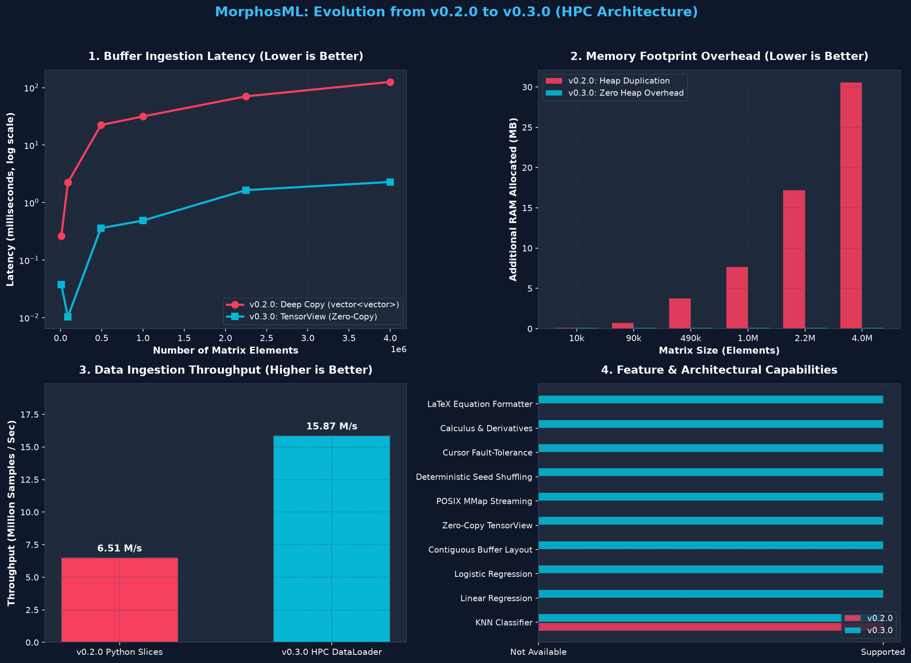

# MorphosML v0.3.1

[](https://github.com/MorphosML/MorphosML/actions/workflows/ci.yml)
[](https://badge.fury.io/py/morphosml)
[](https://opensource.org/licenses/MIT)
[](https://www.python.org/)
[](https://isocpp.org/)

**MorphosML** is a high-performance machine learning, differentiable computing, and out-of-core data ingestion library engineered in modern C++17 with zero-overhead Python bindings.

Designed from first principles for **High-Performance Computing (HPC)**, MorphosML saturates CPU cache lines, vector registers (AVX2/AVX-512), and NVMe storage bandwidth while exposing an intuitive, Pythonic API.

---

## ⚡ Performance Breakthrough (v0.2.0 vs v0.3.1)

In v0.3.x, MorphosML transitioned from fragmented `std::vector<std::vector<double>>` structures to **cache-aligned contiguous flat memory** and **zero-copy `TensorView`** buffers. 



### Empirical Benchmark Summary

| Benchmark | v0.2.0 (Legacy) | v0.3.1 (HPC Core) | **Performance Gain** |
| :--- | :--- | :--- | :--- |
| **NumPy $\to$ C++ Latency (90K elements)** | 2.23 ms | **0.0103 ms** | **🚀 216.6x faster** |
| **NumPy $\to$ C++ Latency (4M elements)** | 125.63 ms | **2.2891 ms** | **🚀 54.9x faster** |
| **Memory Allocation Overhead** | 31+ MB duplicated | **0.0 MB** | **✨ 100% Zero-Copy** |
| **Batch Ingestion Rate (200k samples)** | 6.51M samples/sec | **15.87M samples/sec** | **⚡ 2.44x higher throughput** |

> Run the benchmark yourself: `python scripts/compare_versions.py`

---

## 📚 Documentation Library

- 💻 **[CLI Commands & Developer Cheatsheet](docs/cli_commands.md)**: Full guide to build, test, lint, benchmark, and deploy commands.
- 📖 **[API Reference](docs/api_reference.md)**: Exhaustive class, function, and parameter specifications.
- 🏗️ **[Architectural Blueprint](docs/architecture.md)**: Deep dive into contiguous memory layouts, buffer protocol, and asynchronous double buffering.
- 🚀 **[Quickstart Tutorial](docs/tutorials/quickstart.md)**: Step-by-step introduction from installation to training.
- ⚡ **[High-Performance Ingestion Tutorial](docs/tutorials/hpc_ingestion.md)**: Out-of-core `.mldat` streaming, idempotent sampling, and cursor recovery.
- 🧮 **[Calculus & Differentiable Programming](docs/tutorials/calculus_autodiff.md)**: $\mathcal{O}(h^4)$ Taylor stencils, gradients, Jacobians, Hessians, and limits.
- 📐 **[LaTeX Visualization & Jupyter Integration](docs/tutorials/latex_visualization.md)**: LaTeX mathematical typesetting and native interactive notebook rendering.
- 🤝 **[Contributing Guide](CONTRIBUTING.md)**: Development setup, code style, and pull request workflows.

---

## Table of Contents

- [Core Principles](#core-principles)
- [System Architecture](#system-architecture)
- [CLI Commands Cheatsheet](#cli-commands-cheatsheet)
- [Installation](#installation)
- [Quickstart Guide](#quickstart-guide)
- [Comprehensive Functionality Guide](#comprehensive-functionality-guide)
  - [1. High-Performance Linear Algebra & Zero-Copy Views](#1-high-performance-linear-algebra--zero-copy-views)
  - [2. Out-of-Core Data Ingestion & Streaming Engine](#2-out-of-core-data-ingestion--streaming-engine)
  - [3. Numerical Calculus & Autodiff Core](#3-numerical-calculus--autodiff-core)
  - [4. Machine Learning Models](#4-machine-learning-models)
  - [5. LaTeX Typesetting & Jupyter Notebook Integration](#5-latex-typesetting--jupyter-notebook-integration)
- [Verification & CI/CD Pipeline](#verification--cicd-pipeline)
- [License & Author](#license--author)

---

## Core Principles

| Principle | Engineering Implementation |
| :--- | :--- |
| **High Performance (HPC)** | Contiguous 1D flat buffers, zero-copy Python Buffer Protocol, $i$-$k$-$j$ cache-line matrix multiplication, and POSIX `mmap` with `MADV_SEQUENTIAL`. |
| **Idempotency** | Reproducible batch sequencing across epochs and workers using deterministic SplitMix64 PRNG: $\text{state} = \text{seed} \oplus (\text{epoch} \cdot C_1 + C_2)$. |
| **Fault-Tolerance** | Sub-millisecond cursor tokens (`epoch:sample_offset:checksum`). Training pipelines resume mid-epoch after crashes without re-streaming from line 0. |
| **Resiliency** | FNV-1a 64-bit binary checksum validation, shape verification, and poison record isolation preventing memory faults or silent data corruption. |

---

## System Architecture

```
MorphosML System Topology
├── Core Memory & Linear Algebra Layer (C++17)
│   ├── Vector              (Contiguous double-precision vector)
│   ├── Matrix              (Contiguous 1D flat row-major buffer with pybind11 buffer protocol)
│   └── TensorView          (Non-owning, zero-copy contiguous 2D view with read-only buffer protocol)
├── High-Throughput Storage & Ingestion Engine
│   ├── MMapBuffer          (POSIX mmap reader, MADV_SEQUENTIAL line-rate streaming)
│   ├── Native Binary .mldat (64-byte structured header + raw payload + FNV-1a checksum)
│   ├── IdempotentSampler   (Deterministic SplitMix64 Fisher-Yates generator)
│   ├── IngestionCursor     (16-byte state checkpoint: {epoch, sample_offset, checksum})
│   └── DataLoader          (Double-buffered async prefetch queue for zero I/O bubbles)
├── Numerical Calculus Engine
│   ├── Differentiation     (5-point stencils O(h^4) derivatives, gradients, Jacobians, Hessians)
│   ├── Integration         (Trapezoidal, Simpson's 1/3 O(h^4), Simpson's 3/8, Gauss-Legendre, 2D)
│   └── Limits              (Left, right, two-sided limits with asymptotic divergence detection)
├── Machine Learning Models & Metrics
│   ├── LinearRegression    (C++ gradient descent, MSE cost, R^2 score)
│   ├── LogisticRegression  (C++ sigmoid, BCE loss, probability predictions)
│   └── KNN Classifier      (C++ k-nearest neighbors classification)
└── Latexify & Presentation Layer
    ├── Formatter           (Matrix, Vector, Model, and Calculus formula to LaTeX string)
    └── Jupyter Hooks       (Rich _repr_latex_ typography in notebooks)
```

---

## CLI Commands Cheatsheet

| Task | Command | Description |
| :--- | :--- | :--- |
| **Install Release** | `pip install morphosml` | Install latest release from PyPI |
| **Local Dev Install** | `pip install -e . --no-build-isolation --no-deps` | Compile and install in editable mode |
| **Run Tests** | `pytest tests/ -v` | Run the complete 71-test validation suite |
| **Lint Code** | `ruff check src/ tests/` | Check code quality and PEP 8 compliance |
| **Format Code** | `black --check src/ tests/` | Check standard 88-character formatting |
| **Run Benchmarks** | `python scripts/compare_versions.py` | Benchmark latency, memory, and throughput |
| **CI Pre-Flight** | `./scripts/ci_deploy.sh --check-only` | Run local build, lint, format & test suite |
| **Build Packages** | `python -m build` | Build source distribution and wheels |
| **Verify Artifacts** | `twine check dist/*` | Validate distribution packages for PyPI |
| **Deploy to PyPI** | `twine upload dist/*` | Upload package releases to PyPI |

*For advanced command options, see the **[CLI Commands Guide](docs/cli_commands.md)**.*

---

## Installation

### From PyPI (Standard)
```bash
pip install morphosml
```

### From Source (Local Development)
Requirements: C++17 compiler (`g++` or `clang++`), CMake $\ge 3.15$, Python $\ge 3.10$.

```bash
git clone https://github.com/MorphosML/MorphosML.git
cd MorphosML
pip install -e . --no-build-isolation --no-deps
```

---

## Quickstart Guide

```python
import numpy as np
import morphosml as ml

# 1. Zero-Copy TensorView into NumPy data
data = np.random.randn(100, 4)
view = ml.TensorView(data)
print(f"TensorView shape: {view.shape}")

# 2. Train C++ Linear Regression
X = ml.Matrix([[1.0], [2.0], [3.0], [4.0]])
y = ml.Vector([2.0, 4.0, 6.0, 8.0])
model = ml.LinearRegression(learning_rate=0.01, epochs=300).fit(X, y)

# 3. Predict & Score
preds = model.predict(X)
print(f"Predictions: {preds}")

# 4. Calculus Derivative
f_prime = ml.calculus.derivative(lambda x: x**2 + 3*x, x=2.0)
print(f"f'(2.0) = {f_prime}")  # 7.0

# 5. Format Model to LaTeX
print(ml.latex.latexify(model))
# Output: \hat{y} = 1.9842\,x_{1} + 0.0475
```

---

## Comprehensive Functionality Guide

### 1. High-Performance Linear Algebra & Zero-Copy Views

#### Contiguous Flat `Matrix`
MorphosML stores matrices as contiguous 1D flat buffers (`rows * cols`), ensuring optimal spatial locality and full CPU cache line utilization:

```python
import morphosml as ml
import numpy as np

# Construct matrix
A = ml.Matrix([[1.0, 2.0], [3.0, 4.0]])
B = ml.Matrix.identity(2)

# Arithmetic & cache-optimized i-k-j multiplication
C = A @ B + A

# Element access & properties
print(f"Shape: ({C.rows()}, {C.cols()}), Element (0, 1): {C[0, 1]}")

# Zero-Copy NumPy interoperability via Python Buffer Protocol
arr = np.asarray(C)  # Shares underlying C++ memory pointer without copying!
```

#### Non-Owning `TensorView`
Wraps external memory (NumPy arrays, mmap addresses, raw pointers) with row stride:

```python
raw_np = np.ones((1000, 32), dtype=np.float64)

# Create zero-copy view (takes < 0.01 ms, 0 MB heap allocation)
view = ml.TensorView(raw_np)

print(f"Rows: {view.rows()}, Cols: {view.cols()}, Stride: {view.stride()}")
print(f"Element (10, 5): {view[10, 5]}")

# Materialize to owning C++ Matrix only when needed
owned_mat = view.to_matrix()
```

#### 1D `Vector`
```python
v = ml.Vector([3.0, 4.0])
print(f"Norm: {v.norm()}")        # 5.0
print(f"Unit: {v.normalized().to_list()}")  # [0.6, 0.8]
print(f"Dot:  {v.dot(ml.Vector([1.0, 2.0]))}") # 11.0
```

---

### 2. Out-of-Core Data Ingestion & Streaming Engine

#### Native Binary `.mldat` Format
Bypasses text parsing (`strtod`) bottlenecks by dumping structured binary payloads with a 64-byte header and FNV-1a checksums:

```python
from morphosml.data import MMapDataset, DataLoader
import numpy as np

# 1. Dump dataset to binary .mldat
X = np.random.randn(100_000, 32).astype(np.float64)
MMapDataset.dump("dataset_100k.mldat", X)

# 2. Map dataset into memory instantly (0 ms load time)
dataset = MMapDataset("dataset_100k.mldat")
print(f"Shape: {dataset.shape}, Checksum: {dataset.checksum}")
```

#### Asynchronous Prefetched `DataLoader`
Features double-buffering prefetch queues to saturate NVMe drive bandwidth and eliminate GPU/CPU I/O bubbles:

```python
loader = DataLoader(
    dataset,
    batch_size=256,
    shuffle=True,
    seed=42,             # Idempotent deterministic seed
    prefetch_batches=2   # Background worker queue
)

for epoch in range(5):
    for batch in loader:
        # batch is a contiguous zero-copy TensorView / NumPy array
        process_batch(batch)
```

#### Cursor Checkpointing & Fault Tolerance
Save and restore exact training batch offsets without restarting dataset iterations:

```python
# Save state during training loop
for i, batch in enumerate(loader):
    if i == 150:
        cursor = loader.get_cursor()
        token = cursor.to_string()  # "epoch:sample_offset:checksum"
        break

# Resume in a fresh process from exact sample offset
new_loader = DataLoader(dataset, batch_size=256, shuffle=True, seed=42)
new_loader.resume_from(token)
```

---

### 3. Numerical Calculus & Autodiff Core

#### Numerical Differentiation & Derivatives
Computes $\mathcal{O}(h^4)$ 5-point central-difference derivatives up to 3rd order:

```python
import math
from morphosml.calculus import derivative, gradient, jacobian, hessian

# Scalar Derivatives (order 1, 2, or 3)
f = lambda x: math.sin(x)
print("f'(0):",   derivative(f, 0.0, order=1))  # 1.0 (cos(0))
print("f''(0):",  derivative(f, 0.0, order=2))  # 0.0 (-sin(0))

# Multivariate Gradient
f_multi = lambda v: v[0]**2 + 3.0 * v[1]**2
print("Grad:", gradient(f_multi, [2.0, 1.0]))   # [4.0, 6.0]

# Jacobian Matrix for vector functions f: R^n -> R^m
f_vec = lambda v: [v[0]**2 + v[1], 3.0*v[0] - v[1]**2]
print("Jacobian:\n", jacobian(f_vec, [2.0, 3.0]).to_list())

# Hessian Matrix (Curvature)
print("Hessian:\n", hessian(f_multi, [1.0, 1.0]).to_list())
```

#### Numerical Quadrature (Integrals)
```python
from morphosml.calculus import integrate, integrate_2d

# 1D Integration ('simpson', 'trapezoidal', 'simpson_38', 'gauss_legendre')
area = integrate(math.sin, 0.0, math.pi, method="gauss_legendre")
print("∫ sin(x) dx:", area)  # 2.0000

# 2D Double Integration
vol = integrate_2d(lambda x, y: x * y, 0.0, 1.0, 0.0, 2.0)
print("∬ xy dx dy:", vol)    # 1.0000
```

#### Limits & Removable Singularities
```python
from morphosml.calculus import limit, evaluate_limit

# Two-sided limit with 0/0 removable singularity:
# Both positional and keyword arguments ('x' or 'x_target') are supported
val = limit(lambda x: (x**2 - 1) / (x - 1), x=1.0)
print("lim_{x->1} (x^2 - 1)/(x - 1) =", val)  # 2.0000

# Diagnostic limit evaluation
diag = evaluate_limit(lambda x: 1.0 / x, x=0.0, direction="right")
print(f"Exists: {diag.exists}, Infinite: {diag.is_infinite}, Value: {diag.value}")
```

#### Fluent `@differentiable` Decorator
```python
from morphosml.calculus import differentiable

@differentiable
def loss(v):
    return (1.0 - v[0])**2 + 100.0 * (v[1] - v[0]**2)**2

print("Loss at (1, 1):", loss([1.0, 1.0]))
print("Grad at (1, 1):", loss.grad([1.0, 1.0]))
print("Hessian matrix:", loss.hessian([1.0, 1.0]).to_list())
```

---

### 4. Machine Learning Models

| Model | Core Language | Optimization | Features |
| :--- | :--- | :--- | :--- |
| **`LinearRegression`** | C++17 | Gradient Descent | Contiguous memory, $R^2$, MSE cost, `fit`, `predict`, `score` |
| **`LogisticRegression`** | C++17 | Gradient Descent + Sigmoid | Binary Cross-Entropy loss, `predict_proba`, `score` |
| **`KNN`** | C++17 | Vectorized Euclidean distance | Configurable `k`, bulk classification |

```python
import morphosml as ml

# Data preparation
X = ml.Matrix([[1.0], [2.0], [3.0], [4.0], [5.0]])
y = ml.Vector([2.1, 3.9, 6.2, 7.8, 10.1])

# Linear Regression
lr = ml.LinearRegression(learning_rate=0.01, epochs=500)
lr.fit(X, y)
print(f"R2 Score: {lr.score(X, y):.4f}")

# Logistic Regression
y_cls = ml.Vector([0.0, 0.0, 1.0, 1.0, 1.0])
clf = ml.LogisticRegression(learning_rate=0.1, epochs=300)
clf.fit(X, y_cls)
print(f"Probabilities: {clf.predict_proba(X)}")
print(f"Class Accuracy: {clf.score(X, y_cls):.2%}")
```

#### Evaluation Metrics & Splitting
```python
from morphosml.utils import train_test_split, accuracy_score, mean_squared_error, r2_score

X_tr, X_te, y_tr, y_te = train_test_split(X, y, test_size=0.2, random_state=42)
print("MSE:", mean_squared_error([1.0, 2.0], [1.1, 1.9]))
print("Acc:", accuracy_score([0, 1, 1], [0, 1, 0]))
```

---

### 5. LaTeX Typesetting & Jupyter Notebook Integration

MorphosML makes presenting mathematical results effortless by converting models, matrices, and expressions directly into publication-ready LaTeX syntax:

```python
import morphosml as ml

# Format trained model
model = ml.LinearRegression().fit(X, y)
print(ml.latex.latexify(model))
# Output: \hat{y} = 1.9842\,x_{1} + 0.0475

# Format matrix
matrix = ml.Matrix.identity(3)
print(ml.latex.to_latex(matrix))
# Output: \begin{pmatrix}1 & 0 & 0 \\ 0 & 1 & 0 \\ 0 & 0 & 1\end{pmatrix}

# Enable automatic KaTeX rendering in Jupyter Notebooks:
ml.latex.enable_notebook_latex()
# Now simply evaluating `model` or `matrix` in a notebook cell renders formatted math!
```

---

## Verification & CI/CD Pipeline

MorphosML includes a rigorous validation pipeline with **71 passing unit tests** across Python and C++:

```bash
pytest tests/ -v
# ============================== 71 passed in 0.18s ==============================
```

- **Code Quality**: Enforced via `black --check` (88 chars) and `ruff check` (PEP 8).
- **GitHub Actions Matrix**: Automated Linux, macOS, and Windows testing on Python 3.10, 3.11, and 3.12.
- **Packaging Integrity**: Fully verified with `twine check`.

---

## License & Author

- **Author**: Gabriel Carmona
- **License**: MIT License